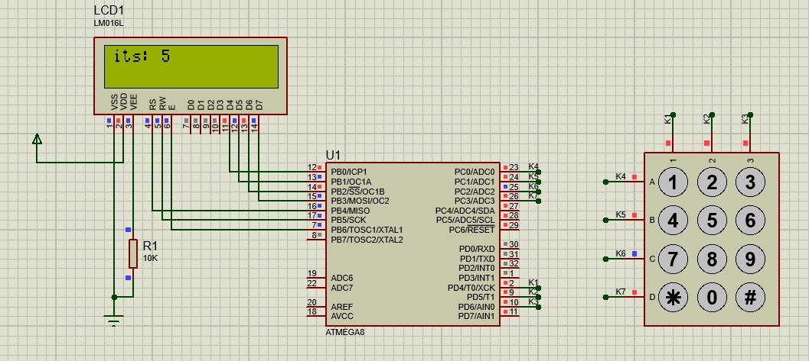

# Waiter
Resturant ordering system simulation using AVR ATMEGA8

## Schematics:

## Simulation Preview:

## Usage:
1. Open `.pdsprj` file using Proteus (v8.11 and higher).
2. Import `.cof` file in ATMEGA8 properties
3. Start simulation

**In order to change code functionalities open `program.*` files using CodeVisionAVR**

