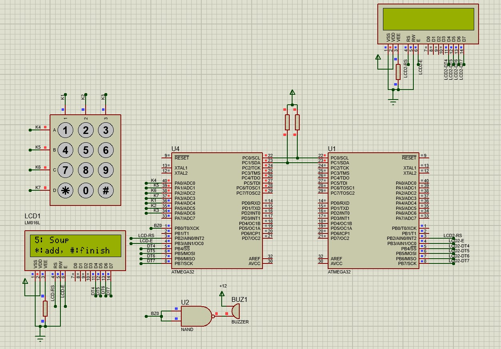
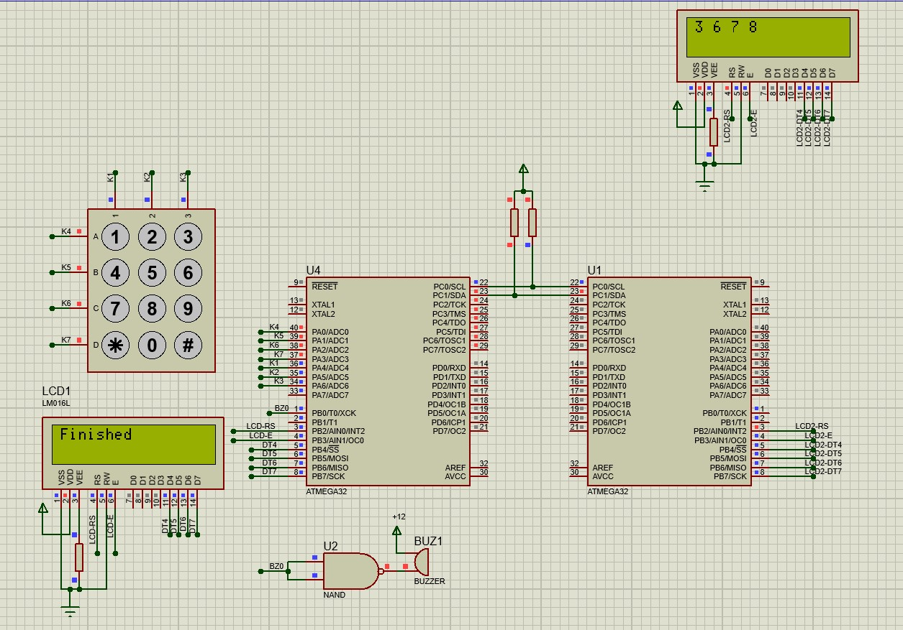

# Waiter
Resturant ordering system simulation using AVR ATMEGA8

## Simulation Preview:

**Demo video is located undner `assets/` dir**
## Usage:
1. Open `HW/Restaurant Menu Ordering System.pdsprj` using Proteus (v8.11 and higher).
2. Import `.hex` files under `SW/.../Debug/` in ATMEGA32 properties for both main controller (one in left side) and kitchen controller (on the right)
3. Start simulation

**In order to change code functionalities edit `program.c` and build them again using `Atmel Studio`**

